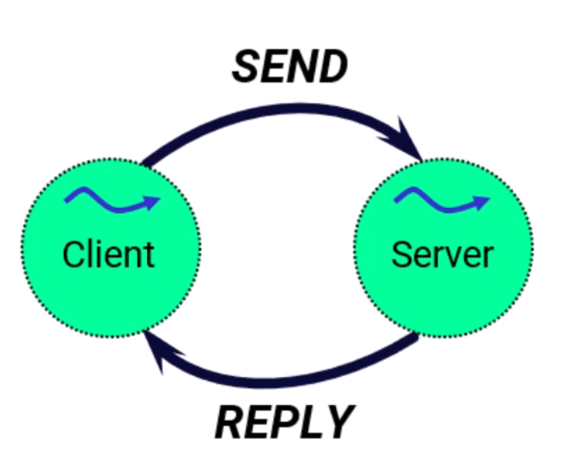
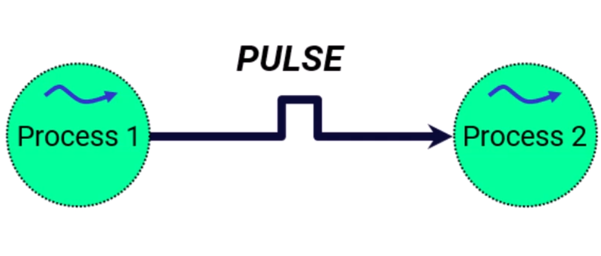

# Inter Process Communication

#qnx 

qnx providex the following:

- messages for exchanging information between processes 
- pulses for delivering notifications
- signals for interrupting a process
  - like terminatin
- posix message queue for queued data delivery

## messages 

- synchronous

 ## pulses

- async 

 

## signals 

- heavy 
- interrupt another process 

## message queues 

