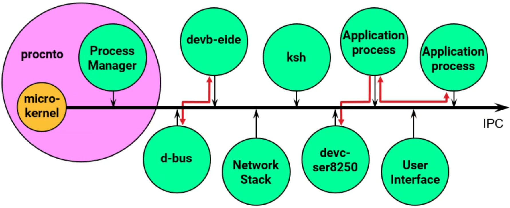

# microkernel

#qnx #rtos   

- each driver is a [[process]]
- applications are processes  
- ensures resilience and stability 
- ipc communication 
- adds context switching

## qnx microkernel

CamelCase qnx functions are **kernel calls** 

- when making a kernel calls user code swithes to **microkernel code**
- elevated privileges
- kernel stack

- three microkernel threads per core 
    - IST for interprocessor  interrupts
    - IST for timer interrupts 
    - idle thread

### features
- [[Inter Process Communication]]
- syncronization
  - mutex
  - condvar  : wait for change
  - semaphore : wait on counter
  - barrier : wait for threads
  - rwlocks : separate read and write locking
- time 
  - time of day : supplied in hw 
  - timer counters with interrupts
- interrupt handling
  - all interrupts come to the microk
  - a thread can:
    - register as an Interrupt Service thread
    - request using an event
- [[scheduling]]

#### behavior
- runs when:
  - a kernel call is made
  - an interrupt is called
  - processor raises fault or exception
- dedicated threads for
  - interprocessors interrupts
  - clock interruptsidle
- runs on the cores where:
  - kernel call was made
  - interrupt was directed
  - fault happened

[//begin]: # "Autogenerated link references for markdown compatibility"1[process]: process.md "process"1[Inter Process Communication]: <Inter Process Communication.md> "Inter Process Communication"1[scheduling]: scheduling.md "scheduling"1[//end]: # "Autogenerated link references"

[//begin]: # "Autogenerated link references for markdown compatibility"
[process]: process.md "process"
[Inter Process Communication]: <Inter Process Communication.md> "Inter Process Communication"
[scheduling]: scheduling.md "scheduling"
[//end]: # "Autogenerated link references"