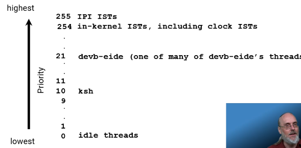

# priority

#rtos #qnx 

priority in qnx goes from 0 (lowest) to 255 (highest)
- 255 reserved for inter procesor interrupts -> kernel talking to itself among cores 
- 0 reserved for idle threads
- matters only for **runnable** [[thread states]]
- no fair share, only preemtive scheduling  (high wins over low prio)
 

[//begin]: # "Autogenerated link references for markdown compatibility"
[thread states]: <thread states> "thread states"
[//end]: # "Autogenerated link references"