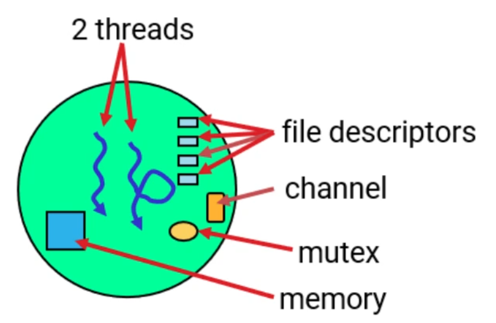

# process

#rtos

- owns memory and resourves
- protected from other processes 
- identified with unique process ids pid

# thread 

- units of executin within a process
- identified by thread ids tids, unique within a process 
- attributes:
  - priority
  - [[scheduling]] algorithm
  - masks
  - stack allocations
- shares resources within the process with other local threads

[//begin]: # "Autogenerated link references for markdown compatibility"
[scheduling]: scheduling.md "scheduling"
[//end]: # "Autogenerated link references"
