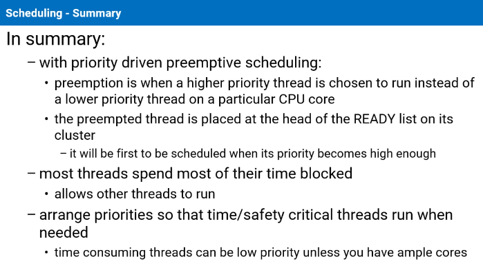

# scheduling

#rtos

- we schedule [threads](process.md)
- different scheduling policies
- different [scheduling algorithms](assets/image-6.png) 
  - [round robin](assets/image-7.png) complicated on multicore
  - [sporadic](assets/image-8.png) scheduling [diagram](assets/image-9.png)
  - 

#qnx uses cluster based scheduling
- ensures predictability 
- fixed scheduling cost 
- cluster is a set of related cores 
- defined by the board support package at startup code 
- predefined clusters
  - cluster containing every core
  - one cluster for each core
- threads running on specific core 
- cluster contains the list of ready cores
- threads are bound to clusters with core affinity through `ThreadCtl()`

 

