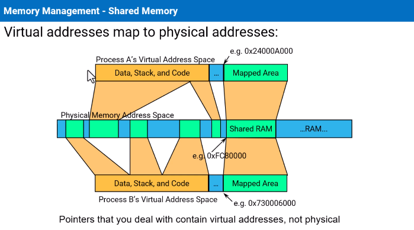

# virtual address

#rtos #os 

space range assigned to a process
- pointers and addresses will be in process virtual space
- memory can be contiguous virtaully but fisically scattered

in #qnx [pathname](assets/image-12.png) define resoruces, the resource is controlled by the proc

